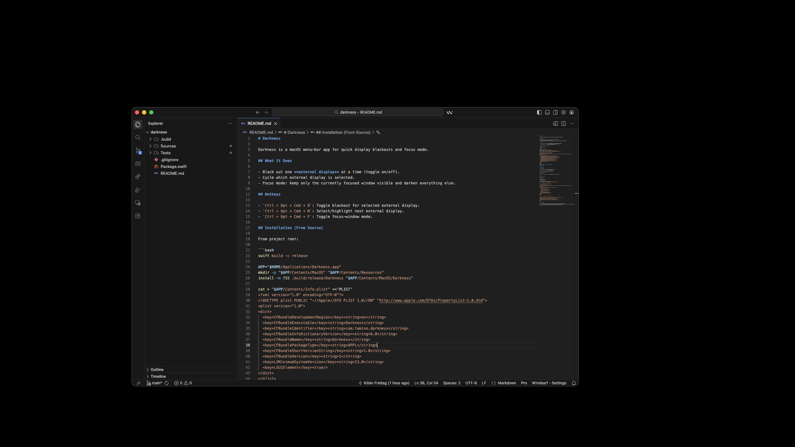

# Darkness

Darkness is a macOS menu-bar app for quick display blackouts and single window focus mode.




## What It Does

- Focus mode: keep only the currently focused window visible and darken everything else.
- Black out one **external display** at a time (toggle on/off).
- Cycle which external display is selected.

## Hotkeys

- `Ctrl + Opt + Cmd + B`: Toggle blackout for selected external display.
- `Ctrl + Opt + Cmd + N`: Select/highlight next external display.
- `Ctrl + Opt + Cmd + F`: Toggle focus-window mode.

## Installation (From Source)

From project root:

```bash
swift build -c release

APP="$HOME/Applications/Darkness.app"
mkdir -p "$APP/Contents/MacOS" "$APP/Contents/Resources"
install -m 755 .build/release/Darkness "$APP/Contents/MacOS/Darkness"

cat > "$APP/Contents/Info.plist" <<'PLIST'
<?xml version="1.0" encoding="UTF-8"?>
<!DOCTYPE plist PUBLIC "-//Apple//DTD PLIST 1.0//EN" "http://www.apple.com/DTDs/PropertyList-1.0.dtd">
<plist version="1.0">
<dict>
  <key>CFBundleDevelopmentRegion</key><string>en</string>
  <key>CFBundleExecutable</key><string>Darkness</string>
  <key>CFBundleIdentifier</key><string>com.tamino.darkness</string>
  <key>CFBundleInfoDictionaryVersion</key><string>6.0</string>
  <key>CFBundleName</key><string>Darkness</string>
  <key>CFBundlePackageType</key><string>APPL</string>
  <key>CFBundleShortVersionString</key><string>1.0</string>
  <key>CFBundleVersion</key><string>1</string>
  <key>LSMinimumSystemVersion</key><string>13.0</string>
  <key>LSUIElement</key><true/>
</dict>
</plist>
PLIST

codesign --force --deep --sign - "$APP"
open -na "$APP"
```

## Permissions

Darkness needs:

- **Accessibility** (for focused-window detection)
- **Input Monitoring** (for global hotkeys)

On first run, allow both in System Settings.

If macOS blocks launch:

```bash
xattr -dr com.apple.quarantine "$HOME/Applications/Darkness.app"
```

## Start at Login

Run this once:

```bash
/bin/bash <<'BASH'
set -euo pipefail

APP="$HOME/Applications/Darkness.app"
PLIST="$HOME/Library/LaunchAgents/com.tamino.darkness.plist"

mkdir -p "$HOME/Library/LaunchAgents"

cat > "$PLIST" <<'PLIST'
<?xml version="1.0" encoding="UTF-8"?>
<!DOCTYPE plist PUBLIC "-//Apple//DTD PLIST 1.0//EN" "http://www.apple.com/DTDs/PropertyList-1.0.dtd">
<plist version="1.0">
<dict>
  <key>Label</key><string>com.tamino.darkness</string>
  <key>ProgramArguments</key>
  <array>
    <string>/usr/bin/open</string>
    <string>-ga</string>
    <string>__APP_PATH__</string>
  </array>
  <key>RunAtLoad</key><true/>
  <key>LimitLoadToSessionType</key>
  <array><string>Aqua</string></array>
</dict>
</plist>
PLIST

sed -i '' "s|__APP_PATH__|$APP|g" "$PLIST"

/bin/launchctl bootout "gui/$(id -u)/com.tamino.darkness" 2>/dev/null || true
/bin/launchctl remove com.tamino.darkness 2>/dev/null || true
/bin/launchctl bootstrap "gui/$(id -u)" "$PLIST"
/bin/launchctl enable "gui/$(id -u)/com.tamino.darkness"
/bin/launchctl kickstart -k "gui/$(id -u)/com.tamino.darkness"
BASH
```

## Usage Notes

- If `B` says no display is toggled, no external displays are currently detected.
- Focus mode requires a detectable focused window. If AX lookup fails, Darkness falls back to frontmost window info.
- Menu bar icon is the app control surface for manual toggles and quit.
